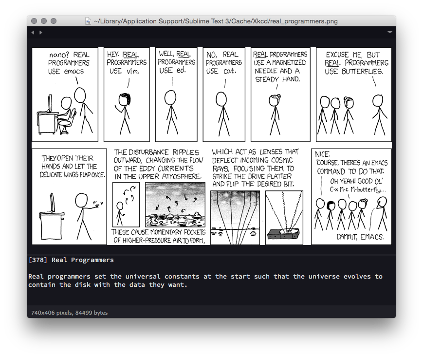

# Xkcd
Sublime Text 3 package for viewing [xkcd](http://www.xkcd.com) comics.
Opens selected comic, title and alt-text in a transient view.

Now you too can procrastinate directly from your editor!

## Features
Current features:

* Latest comic
* List (searchable dropdown)
* Random comic

These are all available both via the Command Palette (<kbd>Ctrl</kbd>+<kbd>⇧</kbd>+<kbd>P</kbd> on Windows and Linux or <kbd>⌘</kbd>+<kbd>⇧</kbd>+<kbd>P</kbd> on OS X)
and via user-definable keyboard-shortcuts.

Viewing a random comic is bound <kbd>Ctrl</kbd>+<kbd>Alt</kbd>+<kbd>⇧</kbd>+<kbd>X</kbd> by default.

This package supports http(s) proxies via variables from Package Control settings ("Package Control.sublime-settings").

## Installation
Ensure that you have a relatively recent version of Sublime Text installed (version 3, beta or dev release).

### Via Package Control

The easiest way to install is using [Sublime Package Control](https://sublime.wbond.net), where this package is listed as `Xkcd`.

1. Open Command Palette using menu item `Tools -> Command Palette...` (<kbd>Ctrl</kbd>+<kbd>⇧</kbd>+<kbd>P</kbd> on Windows and Linux or <kbd>⌘</kbd>+<kbd>⇧</kbd>+<kbd>P</kbd> on OS X)
2. Choose `Package Control: Install Package`
3. Find `Xkcd` and hit <kbd>Enter</kbd>

### Manual

You can also install the package manually:

1. [Download the .zip](https://github.com/eivind88/xkcd/archive/master.zip)
2. Unzip and rename the folder to `xkcd`
3. Copy the folder into `Packages` directory, which you can find using the
    menu item `Sublime Text -> Preferences -> Browse Packages...`

## Contributing
Giving feedback regarding the package is strongly encouraged.

If you run into a bug or would like to see a new feature, please open a new issue.

Contributions in the form of code (e.g. implementing new features, bug-fixes)
are also appreciated.

## License
This package is distributed under the terms of the 3-clause New BSD License. See the [license](LICENSE.txt) file for details.

